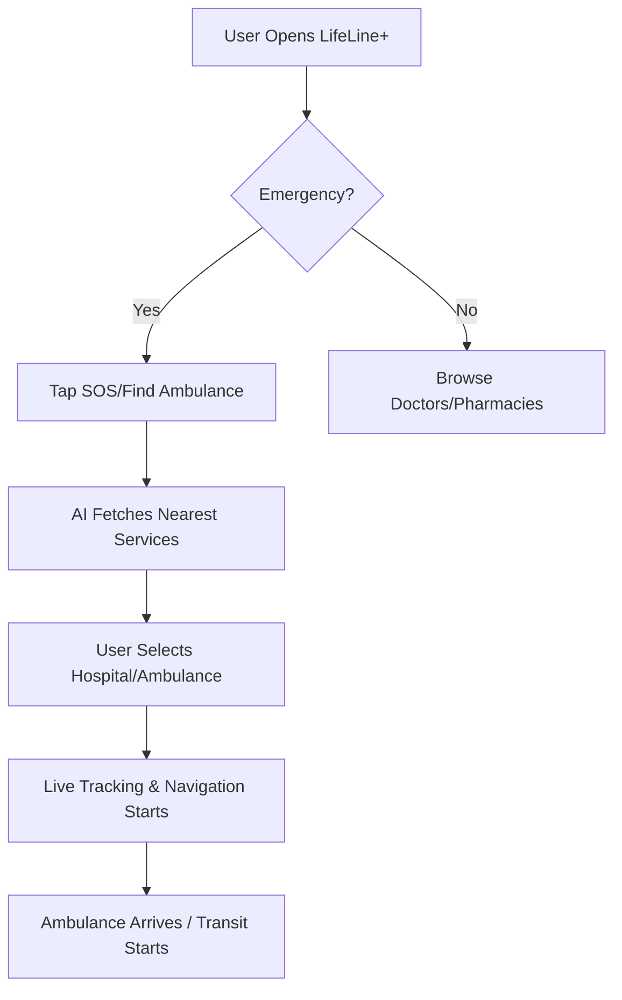
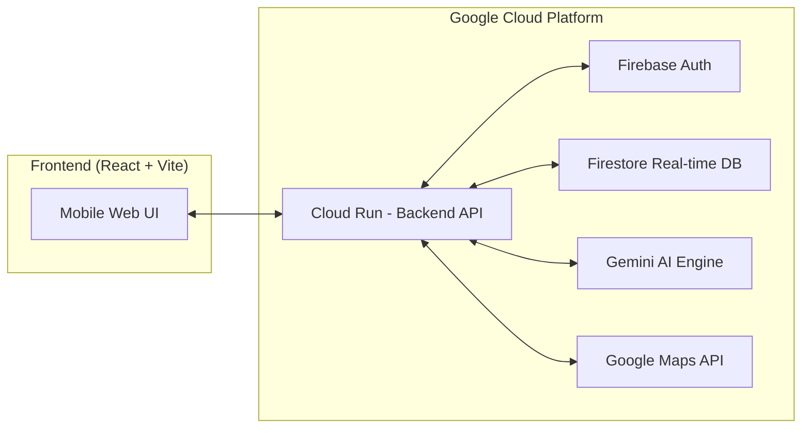

# LifeLine+: Accelerated Emergency Response & Crisis Coordination

## 1. Solution Overview
**LifeLine+** is a high-performance, real-time emergency response platform designed specifically for the Indian landscape. It bridges the critical "Golden Hour" gap by connecting citizens with the nearest hospitals, ambulances, doctors, and police services through a unified, AI-driven interface. By integrating real-time GPS tracking with Google Maps and AI-powered verification, LifeLine+ transforms fragmented emergency services into a cohesive, lifesaving network.

---

## 2. Google AI Services Used
- **Gemini AI (Google AI SDK)**: Powers the "LifeLine+ Assistant" for real-time medical guidance and automates the verification of "Civilian Emergency Mode" requests.
- **Google Maps Platform**: Used for real-time tracking, traffic-aware routing (Directions API), and service discovery (Places API).
- **Google Cloud Run**: Provides the scalable, serverless backend infrastructure.

---

## 3. Solution Brief
LifeLine+ solves the problem of delayed emergency response in high-traffic urban areas and underserved rural regions. It allows users to book verified ambulances, discover nearby medical facilities, and—most uniquely—activate a "Civilian Emergency Mode" that alerts police and local traffic systems when a private vehicle is carrying a patient in critical condition.

---

## 4. Opportunities & Impact

### (i) Differentiation
Unlike standard ambulance booking apps, LifeLine+ is a **Crisis Coordination Hub**. While others focus only on booking, we focus on the **entire transit ecosystem**, including traffic priority and civilian-to-emergency vehicle conversion.

### (ii) Problem Solving
It solves the "fragmented data" problem. In India, finding the *nearest* available ambulance or a specific specialist during an emergency is often done through frantic phone calls. LifeLine+ automates this discovery in under 5 seconds.

### (iii) USP (Unique Selling Proposition)
**The AI-Powered Civilian Emergency Mode.** 
When an ambulance isn't available, LifeLine+ uses Gemini AI to verify a user's emergency status. Once verified, it generates a temporary "Emergency Vehicle ID" for their private car, alerts nearby police to facilitate green-corridor passage, and tracks them live on the grid.

---

## 5. Key Features
- **Real-time Tracking**: Live 3D map visualization of ambulances and user location.
- **AI Emergency Assistant**: Instant medical advice and triage via Gemini AI.
- **Civilian Emergency Mode**: Turning private vehicles into verified emergency units.
- **Unified Discovery**: One-tap access to Hospitals, Police, Doctors, and Pharmacies.
- **SOS Panic Button**: Instant alerts to pre-defined emergency contacts with live location.
- **Traffic-Aware Routing**: Guiding drivers through the fastest possible paths using real-time traffic data.

---

## 6. Process Flow Diagram

---

## 7. Architecture Diagram

---

## 8. Technology Stack
- **Frontend**: React.js, Tailwind CSS, Lucide Icons, Vite.
- **Backend**: Node.js, Express.
- **AI/ML**: Google Gemini Pro (Generative AI).
- **Database**: Firebase Firestore (NoSQL, Real-time).
- **Maps**: Google Maps JavaScript SDK, Directions API, Places API.
- **Deployment**: Google Cloud Run (Containerized Scaling).

---

## 9. Estimated Implementation Cost
- **Infrastructure**: ~$10-50/month (Scaling with Google Cloud Free Tier & Pay-as-you-go).
- **API Usage**: Variable based on traffic (Optimized via caching).
- **Development**: Open-source community driven.

---

## 10. Future Development
- **IoT Integration**: Smart-city traffic light control (Auto-green corridor).
- **Wearable Support**: SOS triggers via Smartwatches and Heart-rate monitors.
- **Offline Mode**: SMS-based emergency requests for low-connectivity areas.
- **Blood Donation Grid**: Real-time matching of donors with nearby hospitals.
